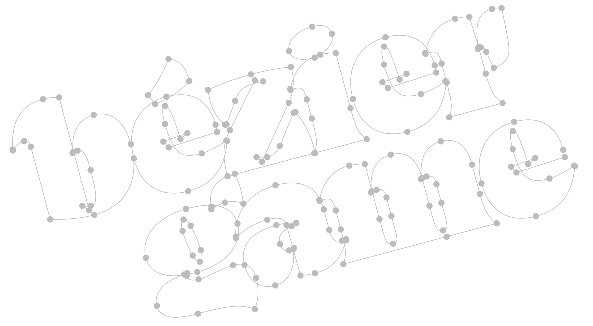
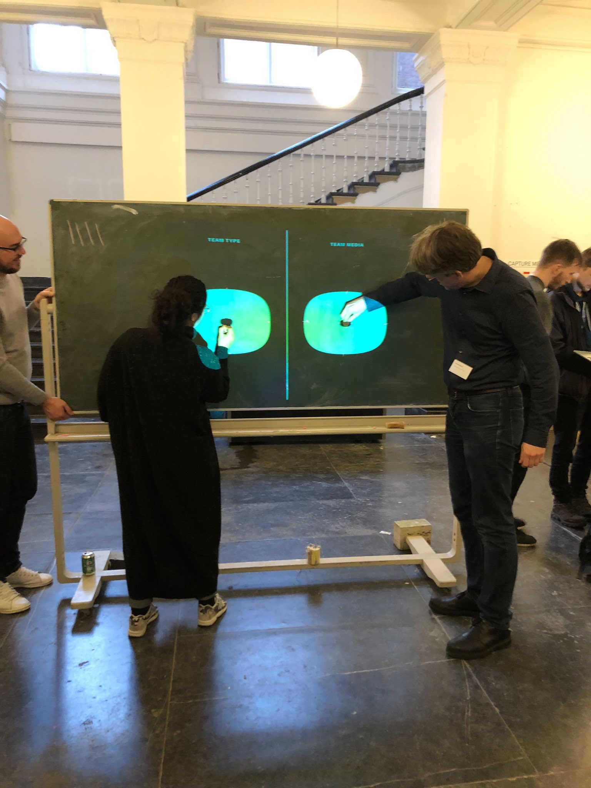
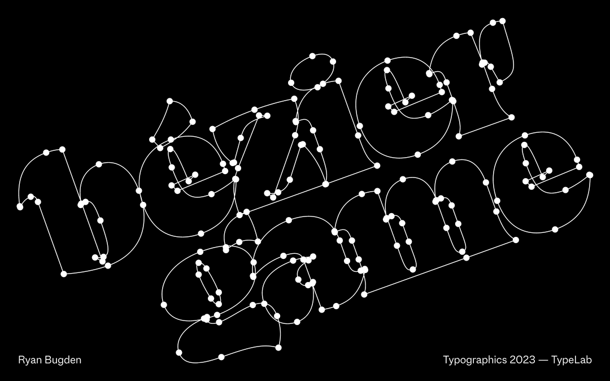
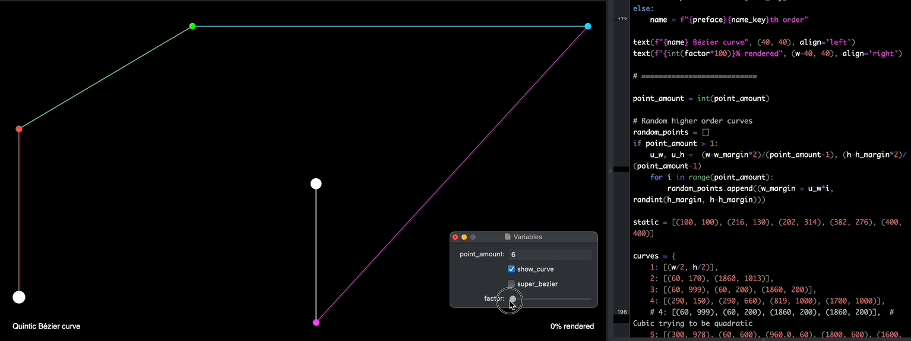

# The Bézier Game

This repository hosts the Bézier Game, and educational materials about curves. I'm putting this on GitHub so that educators can have access to this game and play with their students. If you’d still like to fly me to your city to conduct the game, feel free to contact me :)



## How to set up your own game:

1. Save/clone this whole repository.
2. Open `generate_bezier_game.py` in [DrawBot](https://www.drawbot.com/index.html)
3. Set up the title page; change `school_name` and `event_name`
4. Choose your 2 team names; have fun with it!

>> *Optional: Change the list of glyphs that might show up in the game. The more obscure or complicated, the more difficult the drawing (usually).*

>> *Optional: Decrease the `dot_radius` to increase necessary-accuracy and therefore difficulty.*

5. Drop a bunch of fonts in the folder called `_place_fonts_here`. Be careful to only drop in fonts the drawings of which you trust to be sensible and simple. You don’t want to have to deal with weird point structures! 

>> *Note: If you generate the game and there are some glyphs with funky drawings, you can change `test_mode` to `True`, find the problem fonts, remove the files from your folder, and regenerate.*

6. Run the script, and check the `_output` folder for PDFs.

<div>



</div>

## How to play:
1. Project upon a blackboard or whiteboard. Choose the corresponding PDF from the two that were generated.
2. Line up two teams, single file, on either side of the board.
3. Summon a contestant from each team. Advance the slide.
4. The first person who’s confident they’ve finished should shout “Done!” or the keyword of your choice, at which point both players put down their plotting instruments.
5. Reveal the answers on the next slide. If neither solution is perfect, go back to the previous slide, resume play, and repeat until there’s a winner. 

>> *Dots must fall within the highlighted circles!*

6. Tally the score on the top-right of each side.
7. Play until the score of your choice. 

>> *Suggestion: Roughly the amount of total contestants.*

## Other resources included:
* **Lecture**: The slides I put together to prime the players with the basics of Béziers before starting the game. This primarily features important tips for drawing with Béziers.


* **Math demo**: An interactive DrawBot demo in which you can see the inner workings of several orders of Bézier (De Casteljau) math, from linear to quadratic to cubic, and beyond.


## External resources:
* [Drawing for Interpolation](https://superpolator.com/drawing.html) — Erik van Blokland 
* [Overlapper](https://github.com/ryanbugden/Overlapper) RoboFont Extension — Ryan Bugden
* [Drawing Vectors for Type & Lettering](https://ohnotype.co/blog/drawing-vectors) — Ohno Type Co.
* [The Beauty of Bézier Curves](https://www.youtube.com/watch?v=aVwxzDHniEw) — Freya Holmér

## Any questions?
Feel free to contact me at hi@ryanbugden.com. 


## Version history:
```
2016.10  First instance of idea, manually laid out *sweat-smile-emoji*
2017.06  Debut in TypeLab, Typographics.
2018.06  TypeLab
2018.11  Introduce automation (DrawBot).
2019.01  Debut in KABK Open Day.
2022.11  Refine, add scoreboard & instructions.
2023.06  Initiate GitHub repo. Develop Bézier math demo. TypeLab!
```

#### © Ryan Bugden